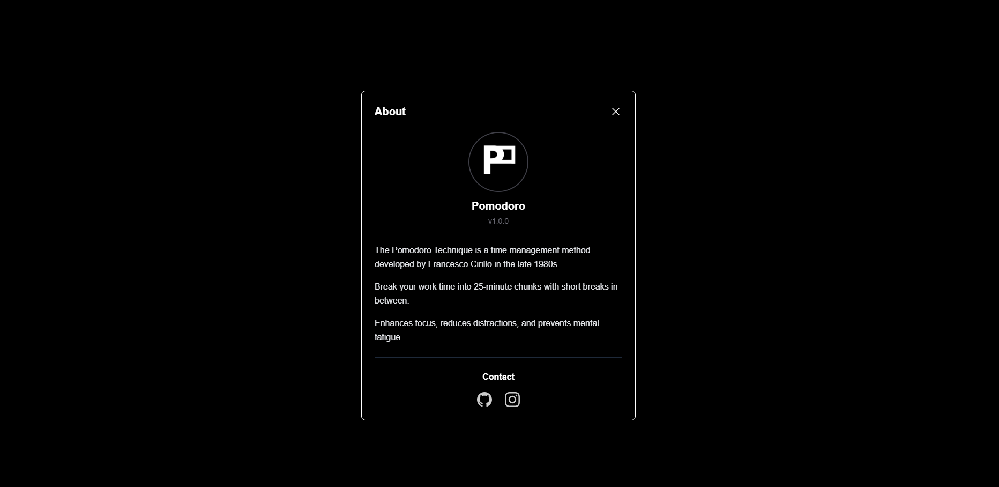
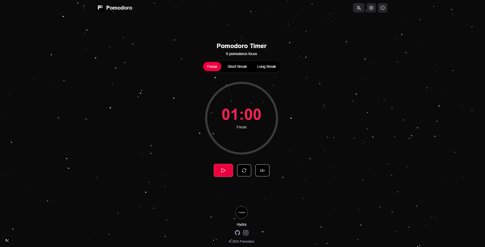
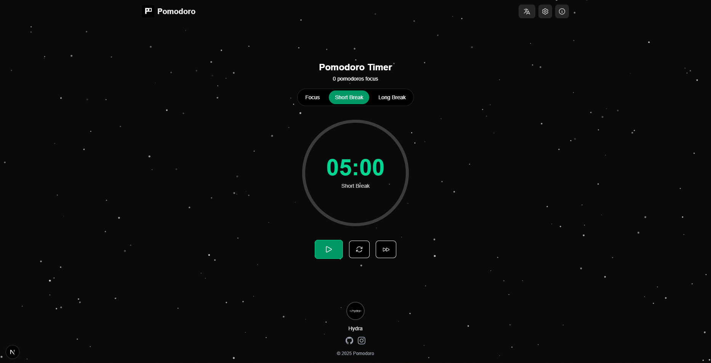
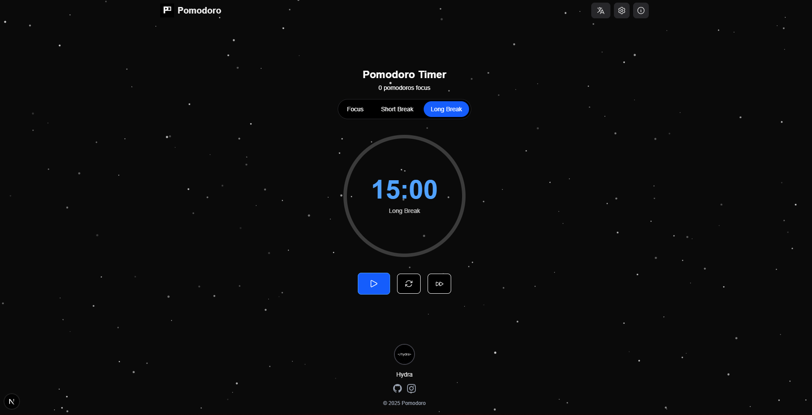

# Pomodoro Timer App



A sleek and intuitive Pomodoro timer application built with Next.js and TypeScript, designed to boost your productivity and help you manage your work sessions effectively.

## 🌟 Features

- **Pomodoro Technique Implementation**: Focus sessions followed by short and long breaks

- **Customizable Timers**: Adjust durations for focus and break sessions

- **Beautiful Animations**: Responsive UI with smooth animations and transitions

- **Multilingual Support**: Available in English and Turkish

- **Visual Progress Tracking**: Circular progress indicator shows session completion

- **Configurable Settings**: Personalize your experience with customizable options:

  - Focus duration
  - Short break duration
  - Long break duration
  - Number of cycles
  - Auto-start options
  - Sound notifications
  - Background selection

- **Responsive Design**: Works seamlessly on all devices

## 📸 Screenshots

<div align="center">
  
  
  
</div>

## 🚀 Getting Started

### Prerequisites

- Node.js (version 14.x or higher)
- npm or yarn

### Installation

1. Clone the repository:
   ```bash
   git clone https://github.com/hhydraaa/pomodoro.git
   cd pomodoro-timer
   ```

2. Install the dependencies:
   ```bash
   npm install
   # or
   yarn install
   ```

3. Environment variables:
   - Copy `.env.example` to `.env.local`
   - Update the AdSense publisher ID in `.env.local` if you want to use AdSense
   ```bash
   cp .env.example .env.local
   ```

4. Run the development server:
   ```bash
   npm run dev
   # or
   yarn dev
   ```

5. Open [http://localhost:3000](http://localhost:3000) in your browser to see the application.

### AdSense Integration

If you want to use Google AdSense:
1. Get your publisher ID from Google AdSense
2. Create `.env.local` file in the root directory
3. Add your publisher ID to `.env.local`:
   ```
   NEXT_PUBLIC_ADSENSE_CLIENT=your-publisher-id
   ```
4. For production deployment (e.g., Vercel):
   - Add `NEXT_PUBLIC_ADSENSE_CLIENT` environment variable
   - Set its value to your publisher ID
   - Redeploy your application

Note: The AdSense ads will only appear in production mode and when a valid publisher ID is provided.

## 🔧 Usage

1. **Select a Mode**: Choose between Focus, Short Break, or Long Break modes

2. **Start the Timer**: Click the play button to begin your session

3. **Pause Anytime**: Pause the timer if needed

4. **Reset**: Reset the current session if required

5. **Customize Settings**: Click the settings icon to adjust durations and preferences

6. **Change Language**: Toggle between English and Turkish using the language selector

## 💻 Technologies Used

- **Next.js**: React framework for production

- **TypeScript**: For type-safe code

- **Tailwind CSS**: For styling and responsive design

- **Context API**: For state management

- **LocalStorage**: For persisting user preferences

## 📁 Project Structure

```
├── app/
│   ├── components/        # UI components
│   ├── context/           # React context for state management
│   ├── locales/           # Translations
│   ├── utils/             # Utility functions
│   ├── page.tsx           # Main application page
│   └── layout.tsx         # Root layout
├── public/                # Static assets
├── tailwind.config.js     # Tailwind configuration
└── package.json           # Dependencies and scripts
```

## 🧩 Core Components

- **PomodoroTimer**: Main component orchestrating the timer functionality

- **TimerDisplay**: Shows the current time remaining and session type

- **ProgressCircle**: Visual indicator of progress within a session

- **TimerControls**: Contains buttons for controlling the timer

- **ModeSelector**: Allows switching between different timer modes

- **SettingsModal**: Interface for adjusting timer settings

- **AboutModal**: Information about the application and how to use it

## 🛠️ Development

### Building for Production

```bash
npm run build
# or
yarn build
```

### Running Production Build

```bash
npm start
# or
yarn start
```

## 🤝 Contributing

Contributions are welcome! Feel free to open issues or submit pull requests to help improve this project.

1. Fork the repository

2. Create your feature branch (`git checkout -b feature/amazing-feature`)

3. Commit your changes (`git commit -m 'Add some amazing feature'`)

4. Push to the branch (`git push origin feature/amazing-feature`)

5. Open a Pull Request

## 📜 License

This project is licensed under the GPL-3.0 License - see the LICENSE file for details.

## 🙏 Acknowledgements

- [Pomodoro Technique](https://en.wikipedia.org/wiki/Pomodoro_Technique) by Francesco Cirillo

- [Next.js Documentation](https://nextjs.org/docs)

- [Tailwind CSS](https://tailwindcss.com/)

- Icons from [Heroicons](https://heroicons.com/)

---

<div align="center">
  <p>Made with Next.js by Hydra for better productivity</p>
</div>
